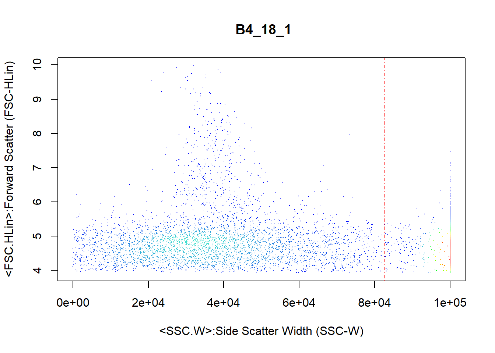

# cyanoFilter

[](https://travis-ci.org/fomotis/cyanoFilter)

cyaoFilter is a package designed to identify, assign indicators and/or
filter out synechoccus type cyanobacteria from a water sample examined
with flowcytometry.

# Installation and Dependencies

Run the `code` below to install the package and all its dependencies.

``` r
install.packages("cyanoFilter")
```

All dependencies both on **CRAN** and **bioconductor** should be
installed when you install the package itself. However, do install the
following needed **bioconductor** packages should you run into errors
while attempting to use the functions in this package.

``` r
install.packages("BiocManager")
library(BiocManager)
install(c("Biobase", "flowCore", "flowDensity"))
```

# Motivation and Background

Flow cytometry is a well-known technique for identifying cell
populations in fluids. It is largely applied in biological and medical
sciences for cell sorting, counting, biomarker detections and protein
engineering. Identifying cell populations in flow cytometry data often
rely on manual gating, a subjective and generally irreproducible method
based on expert knowledge. To address this issue, two filtering
frameworks were developed in **R**, identifying and filtering out two
strains of Synechococcus type cyanobacteria (*BS4* and *BS5*) from flow
cytometry data.

# Usage

The package comes with 2 internal datasets that is used for
demonstrating the usage of the functions contained in the package. The
**meta data** file contains *BS4* and *BS5* samples examined with a
GUAVAVA flow cytometer at 3 dilution levels (*2000*, *10000* and
*20000*) each. The **FCS** file contains the flow cytometer channel
measurements for one of these sample.

## Meta File Preprocessing

### The Good Measurements

`goodfcs()` is deigned to check the cells/\(\mu\)L of the meta file
(normally csv) obtained from the flow cytometer and decide if the
measurements in the FCS file can be trusted.

``` r
#internally contained datafile in cyanoFilter
metadata <- system.file("extdata", "2019-03-25_Rstarted.csv", package = "cyanoFilter",
               mustWork = TRUE)
metafile <- read.csv(metadata, skip = 7, stringsAsFactors = FALSE, check.names = TRUE)
metafile <- metafile[, 1:65] #first 65 columns contains useful information
#extract the part of the Sample.ID that corresponds to BS4 or BS5
metafile$Sample.ID2 <- stringr::str_extract(metafile$Sample.ID, "BS*[4-5]")
#clean up the Cells.muL column
names(metafile)[which(stringr::str_detect(names(metafile), "Cells."))] <- "CellspML"
metafile$Status <- cyanoFilter::goodfcs(metafile = metafile, col_cpml = "CellspML", 
                                        mxd_cellpML = 1000, mnd_cellpML = 50)
#should work fine with tidyverse setup
metafile <- metafile %>% mutate(Status = cyanoFilter::goodfcs(metafile = metafile, col_cpml = 
                                                                "CellspML", mxd_cellpML = 1000,
                                                              mnd_cellpML = 50))
#the whole metadata file
knitr::kable(metafile)
```

| Sample.Number | Sample.ID  | Number.of.Events | Termination.Count | Count.Gate | Dilution.Factor | Original.Volume |  CellspML | Total.Volume | Acquisition.Time..s. | Date.of.Acquisition | Time.of.Acquisition | FSC.Gain | SSC |    GRN.B |    YEL.B | RED.B | NIR.B | RED.R | NIR.R | SSC.1 | GRN.B.1 | YEL.B.1 | RED.B.1 | NIR.B.1 | RED.R.1 | NIR.R.1 | YEL.B….GRN.B | RED.B….GRN.B | NIR.B….GRN.B | RED.R….GRN.B | NIR.R….GRN.B | GRN.B….YEL.B | RED.B….YEL.B | NIR.B….YEL.B | RED.R….YEL.B | NIR.R….YEL.B | GRN.B….RED.B | YEL.B….RED.B | NIR.B….RED.B | RED.R….RED.B | NIR.R….RED.B | GRN.B….NIR.B | YEL.B….NIR.B | RED.B….NIR.B | RED.R….NIR.B | NIR.R….NIR.B | GRN.B….RED.R | YEL.B….RED.R | RED.B….RED.R | NIR.B….RED.R | NIR.R….RED.R | GRN.B….NIR.R | YEL.B….NIR.R | RED.B….NIR.R | NIR.B….NIR.R | RED.R….NIR.R | Threshold.Parameter | Threshold.Value | Flow.Rate | High.Concentration.Warning.Trigger | X..of.Errors…Warnings | User.Login.Name | User.Full.Name | WorkList                                                           | Sample.ID2 | Status |
| ------------: | :--------- | ---------------: | ----------------: | :--------- | --------------: | --------------: | --------: | -----------: | -------------------: | :------------------ | :------------------ | -------: | --: | -------: | -------: | ----: | ----: | ----: | ----: | :---- | :------ | :------ | :------ | :------ | :------ | :------ | :----------- | :----------- | :----------- | :----------- | :----------- | :----------- | :----------- | :----------- | :----------- | :----------- | :----------- | :----------- | :----------- | :----------- | :----------- | :----------- | :----------- | :----------- | :----------- | :----------- | :----------- | :----------- | :----------- | :----------- | :----------- | :----------- | :----------- | :----------- | :----------- | :----------- | :------------------ | --------------: | --------: | ---------------------------------: | --------------------: | :-------------- | :------------- | :----------------------------------------------------------------- | :--------- | :----- |
|             1 | BS4\_20000 |             6918 |              5000 | Cyanos     |           20000 |              10 |  62.02270 |    111.53980 |            189.05051 | 25-MAR-2019         | 12:42:13            | 10.37472 |   1 | 9.934862 | 3.084422 |     1 |     1 |     1 |     1 | Yes   | Yes     | Yes     | Yes     | Yes     | Yes     | Yes     | —            | —            | —            | —            | —            | —            | —            | —            | —            | —            | —            | —            | —            | —            | —            | —            | —            | —            | —            | —            | —            | —            | —            | —            | —            | —            | —            | —            | —            | —            | FSC                 |              50 |      0.59 |                                500 |                     1 | DESKTOP-9MNKV60 | Unknown        | C:/Users/User/Documents/Backup data/2019-03-25\_at\_12-37-08pm.xml | BS4        | good   |
|             2 | BS4\_10000 |             6591 |              5000 | Cyanos     |           10000 |              10 | 116.76311 |     56.44762 |             95.67394 | 25-MAR-2019         | 12:44:25            | 10.37472 |   1 | 9.934862 | 3.084422 |     1 |     1 |     1 |     1 | Yes   | Yes     | Yes     | Yes     | Yes     | Yes     | Yes     | —            | —            | —            | —            | —            | —            | —            | —            | —            | —            | —            | —            | —            | —            | —            | —            | —            | —            | —            | —            | —            | —            | —            | —            | —            | —            | —            | —            | —            | —            | FSC                 |              50 |      0.59 |                                500 |                     1 | DESKTOP-9MNKV60 | Unknown        | C:/Users/User/Documents/Backup data/2019-03-25\_at\_12-37-08pm.xml | BS4        | good   |
|             3 | BS4\_2000  |             6508 |              5000 | Cyanos     |            2000 |              10 | 517.90008 |     12.56613 |             21.29853 | 25-MAR-2019         | 12:45:19            | 10.37472 |   1 | 9.934862 | 3.084422 |     1 |     1 |     1 |     1 | Yes   | Yes     | Yes     | Yes     | Yes     | Yes     | Yes     | —            | —            | —            | —            | —            | —            | —            | —            | —            | —            | —            | —            | —            | —            | —            | —            | —            | —            | —            | —            | —            | —            | —            | —            | —            | —            | —            | —            | —            | —            | FSC                 |              50 |      0.59 |                                500 |                     2 | DESKTOP-9MNKV60 | Unknown        | C:/Users/User/Documents/Backup data/2019-03-25\_at\_12-37-08pm.xml | BS4        | good   |
|             4 | BS5\_20000 |             5976 |              5000 | Cyanos     |           20000 |              10 |  48.31036 |    123.70018 |            209.66132 | 25-MAR-2019         | 12:49:22            | 10.37472 |   1 | 9.934862 | 3.084422 |     1 |     1 |     1 |     1 | Yes   | Yes     | Yes     | Yes     | Yes     | Yes     | Yes     | —            | —            | —            | —            | —            | —            | —            | —            | —            | —            | —            | —            | —            | —            | —            | —            | —            | —            | —            | —            | —            | —            | —            | —            | —            | —            | —            | —            | —            | —            | FSC                 |              50 |      0.59 |                                500 |                     2 | DESKTOP-9MNKV60 | Unknown        | C:/Users/User/Documents/Backup data/2019-03-25\_at\_12-37-08pm.xml | BS5        | bad    |
|             5 | BS5\_10000 |             5844 |              5000 | Cyanos     |           10000 |              10 |  90.51666 |     64.56270 |            109.42831 | 25-MAR-2019         | 12:51:49            | 10.37472 |   1 | 9.934862 | 3.084422 |     1 |     1 |     1 |     1 | Yes   | Yes     | Yes     | Yes     | Yes     | Yes     | Yes     | —            | —            | —            | —            | —            | —            | —            | —            | —            | —            | —            | —            | —            | —            | —            | —            | —            | —            | —            | —            | —            | —            | —            | —            | —            | —            | —            | —            | —            | —            | FSC                 |              50 |      0.59 |                                500 |                     1 | DESKTOP-9MNKV60 | Unknown        | C:/Users/User/Documents/Backup data/2019-03-25\_at\_12-37-08pm.xml | BS5        | good   |
|             6 | BS5\_2000  |             5829 |              5000 | Cyanos     |            2000 |              10 | 400.72498 |     14.54614 |             24.65447 | 25-MAR-2019         | 12:52:47            | 10.37472 |   1 | 9.934862 | 3.084422 |     1 |     1 |     1 |     1 | Yes   | Yes     | Yes     | Yes     | Yes     | Yes     | Yes     | —            | —            | —            | —            | —            | —            | —            | —            | —            | —            | —            | —            | —            | —            | —            | —            | —            | —            | —            | —            | —            | —            | —            | —            | —            | —            | —            | —            | —            | —            | FSC                 |              50 |      0.59 |                                500 |                     1 | DESKTOP-9MNKV60 | Unknown        | C:/Users/User/Documents/Backup data/2019-03-25\_at\_12-37-08pm.xml | BS5        | good   |

``` r
#some interesting columns and the newly added column
knitr::kable(metafile %>% 
              dplyr::select(Sample.ID, Sample.ID2, Number.of.Events, Dilution.Factor, CellspML, Status) )
```

| Sample.ID  | Sample.ID2 | Number.of.Events | Dilution.Factor |  CellspML | Status |
| :--------- | :--------- | ---------------: | --------------: | --------: | :----- |
| BS4\_20000 | BS4        |             6918 |           20000 |  62.02270 | good   |
| BS4\_10000 | BS4        |             6591 |           10000 | 116.76311 | good   |
| BS4\_2000  | BS4        |             6508 |            2000 | 517.90008 | good   |
| BS5\_20000 | BS5        |             5976 |           20000 |  48.31036 | bad    |
| BS5\_10000 | BS5        |             5844 |           10000 |  90.51666 | good   |
| BS5\_2000  | BS5        |             5829 |            2000 | 400.72498 | good   |

The **Status** columns indicates if the file at the current dilution
level is good.

### Files to Retain

Generally, reading **FCS** files with the `read.FCS()` function from the
`flowCore` package takes time, hence it can save you considerable amount
of time to read only the good files. An **FCS** normally contains data
from many experiment or same experiment measured at different dilution
levels. Some of these would be determined bad by the `goodfcs()`
function and should be avoided. The `retain()` function is especially
designed for this.

Since each sample, i.e. *BS4* and *BS5* were measured at 3 dilution
levels it means that the 3 rows in *metafile* containing the
measurements of *BS4* are to be examined together by the `retain()`
function and the same should be done for the *BS5* dilution levels. This
can easily be achieved by using some `tidyverse` function to break the
*metafile* into two based on *Sample.ID2* and apply `retain()` on the
broken dataset.

``` r
#break csv file into groups (2 in this case) based on sample ID2
broken <- metafile %>% group_by(Sample.ID2) %>% nest() 
#this is how broken looks like
broken
> # A tibble: 2 x 2
>   Sample.ID2 data             
>   <chr>      <list>           
> 1 BS4        <tibble [3 x 66]>
> 2 BS5        <tibble [3 x 66]>

# Let's apply the function
metafile$Retained <- unlist(map(broken$data, function(.x) {
    cyanoFilter::retain(meta_files = .x, make_decision = "maxi",
                      Status = "Status", 
                      CellspML = "CellspML")
  })
)  
#the whole metadata file
knitr::kable(metafile)
```

| Sample.Number | Sample.ID  | Number.of.Events | Termination.Count | Count.Gate | Dilution.Factor | Original.Volume |  CellspML | Total.Volume | Acquisition.Time..s. | Date.of.Acquisition | Time.of.Acquisition | FSC.Gain | SSC |    GRN.B |    YEL.B | RED.B | NIR.B | RED.R | NIR.R | SSC.1 | GRN.B.1 | YEL.B.1 | RED.B.1 | NIR.B.1 | RED.R.1 | NIR.R.1 | YEL.B….GRN.B | RED.B….GRN.B | NIR.B….GRN.B | RED.R….GRN.B | NIR.R….GRN.B | GRN.B….YEL.B | RED.B….YEL.B | NIR.B….YEL.B | RED.R….YEL.B | NIR.R….YEL.B | GRN.B….RED.B | YEL.B….RED.B | NIR.B….RED.B | RED.R….RED.B | NIR.R….RED.B | GRN.B….NIR.B | YEL.B….NIR.B | RED.B….NIR.B | RED.R….NIR.B | NIR.R….NIR.B | GRN.B….RED.R | YEL.B….RED.R | RED.B….RED.R | NIR.B….RED.R | NIR.R….RED.R | GRN.B….NIR.R | YEL.B….NIR.R | RED.B….NIR.R | NIR.B….NIR.R | RED.R….NIR.R | Threshold.Parameter | Threshold.Value | Flow.Rate | High.Concentration.Warning.Trigger | X..of.Errors…Warnings | User.Login.Name | User.Full.Name | WorkList                                                           | Sample.ID2 | Status | Retained |
| ------------: | :--------- | ---------------: | ----------------: | :--------- | --------------: | --------------: | --------: | -----------: | -------------------: | :------------------ | :------------------ | -------: | --: | -------: | -------: | ----: | ----: | ----: | ----: | :---- | :------ | :------ | :------ | :------ | :------ | :------ | :----------- | :----------- | :----------- | :----------- | :----------- | :----------- | :----------- | :----------- | :----------- | :----------- | :----------- | :----------- | :----------- | :----------- | :----------- | :----------- | :----------- | :----------- | :----------- | :----------- | :----------- | :----------- | :----------- | :----------- | :----------- | :----------- | :----------- | :----------- | :----------- | :----------- | :------------------ | --------------: | --------: | ---------------------------------: | --------------------: | :-------------- | :------------- | :----------------------------------------------------------------- | :--------- | :----- | :------- |
|             1 | BS4\_20000 |             6918 |              5000 | Cyanos     |           20000 |              10 |  62.02270 |    111.53980 |            189.05051 | 25-MAR-2019         | 12:42:13            | 10.37472 |   1 | 9.934862 | 3.084422 |     1 |     1 |     1 |     1 | Yes   | Yes     | Yes     | Yes     | Yes     | Yes     | Yes     | —            | —            | —            | —            | —            | —            | —            | —            | —            | —            | —            | —            | —            | —            | —            | —            | —            | —            | —            | —            | —            | —            | —            | —            | —            | —            | —            | —            | —            | —            | FSC                 |              50 |      0.59 |                                500 |                     1 | DESKTOP-9MNKV60 | Unknown        | C:/Users/User/Documents/Backup data/2019-03-25\_at\_12-37-08pm.xml | BS4        | good   | No\!     |
|             2 | BS4\_10000 |             6591 |              5000 | Cyanos     |           10000 |              10 | 116.76311 |     56.44762 |             95.67394 | 25-MAR-2019         | 12:44:25            | 10.37472 |   1 | 9.934862 | 3.084422 |     1 |     1 |     1 |     1 | Yes   | Yes     | Yes     | Yes     | Yes     | Yes     | Yes     | —            | —            | —            | —            | —            | —            | —            | —            | —            | —            | —            | —            | —            | —            | —            | —            | —            | —            | —            | —            | —            | —            | —            | —            | —            | —            | —            | —            | —            | —            | FSC                 |              50 |      0.59 |                                500 |                     1 | DESKTOP-9MNKV60 | Unknown        | C:/Users/User/Documents/Backup data/2019-03-25\_at\_12-37-08pm.xml | BS4        | good   | No\!     |
|             3 | BS4\_2000  |             6508 |              5000 | Cyanos     |            2000 |              10 | 517.90008 |     12.56613 |             21.29853 | 25-MAR-2019         | 12:45:19            | 10.37472 |   1 | 9.934862 | 3.084422 |     1 |     1 |     1 |     1 | Yes   | Yes     | Yes     | Yes     | Yes     | Yes     | Yes     | —            | —            | —            | —            | —            | —            | —            | —            | —            | —            | —            | —            | —            | —            | —            | —            | —            | —            | —            | —            | —            | —            | —            | —            | —            | —            | —            | —            | —            | —            | FSC                 |              50 |      0.59 |                                500 |                     2 | DESKTOP-9MNKV60 | Unknown        | C:/Users/User/Documents/Backup data/2019-03-25\_at\_12-37-08pm.xml | BS4        | good   | Retain   |
|             4 | BS5\_20000 |             5976 |              5000 | Cyanos     |           20000 |              10 |  48.31036 |    123.70018 |            209.66132 | 25-MAR-2019         | 12:49:22            | 10.37472 |   1 | 9.934862 | 3.084422 |     1 |     1 |     1 |     1 | Yes   | Yes     | Yes     | Yes     | Yes     | Yes     | Yes     | —            | —            | —            | —            | —            | —            | —            | —            | —            | —            | —            | —            | —            | —            | —            | —            | —            | —            | —            | —            | —            | —            | —            | —            | —            | —            | —            | —            | —            | —            | FSC                 |              50 |      0.59 |                                500 |                     2 | DESKTOP-9MNKV60 | Unknown        | C:/Users/User/Documents/Backup data/2019-03-25\_at\_12-37-08pm.xml | BS5        | bad    | No\!     |
|             5 | BS5\_10000 |             5844 |              5000 | Cyanos     |           10000 |              10 |  90.51666 |     64.56270 |            109.42831 | 25-MAR-2019         | 12:51:49            | 10.37472 |   1 | 9.934862 | 3.084422 |     1 |     1 |     1 |     1 | Yes   | Yes     | Yes     | Yes     | Yes     | Yes     | Yes     | —            | —            | —            | —            | —            | —            | —            | —            | —            | —            | —            | —            | —            | —            | —            | —            | —            | —            | —            | —            | —            | —            | —            | —            | —            | —            | —            | —            | —            | —            | FSC                 |              50 |      0.59 |                                500 |                     1 | DESKTOP-9MNKV60 | Unknown        | C:/Users/User/Documents/Backup data/2019-03-25\_at\_12-37-08pm.xml | BS5        | good   | No\!     |
|             6 | BS5\_2000  |             5829 |              5000 | Cyanos     |            2000 |              10 | 400.72498 |     14.54614 |             24.65447 | 25-MAR-2019         | 12:52:47            | 10.37472 |   1 | 9.934862 | 3.084422 |     1 |     1 |     1 |     1 | Yes   | Yes     | Yes     | Yes     | Yes     | Yes     | Yes     | —            | —            | —            | —            | —            | —            | —            | —            | —            | —            | —            | —            | —            | —            | —            | —            | —            | —            | —            | —            | —            | —            | —            | —            | —            | —            | —            | —            | —            | —            | FSC                 |              50 |      0.59 |                                500 |                     1 | DESKTOP-9MNKV60 | Unknown        | C:/Users/User/Documents/Backup data/2019-03-25\_at\_12-37-08pm.xml | BS5        | good   | Retain   |

``` r
#some interesting column
knitr::kable(metafile %>% 
              dplyr::select(Sample.ID, Sample.ID2, Number.of.Events, Dilution.Factor, CellspML, Status, Retained) )
```

| Sample.ID  | Sample.ID2 | Number.of.Events | Dilution.Factor |  CellspML | Status | Retained |
| :--------- | :--------- | ---------------: | --------------: | --------: | :----- | :------- |
| BS4\_20000 | BS4        |             6918 |           20000 |  62.02270 | good   | No\!     |
| BS4\_10000 | BS4        |             6591 |           10000 | 116.76311 | good   | No\!     |
| BS4\_2000  | BS4        |             6508 |            2000 | 517.90008 | good   | Retain   |
| BS5\_20000 | BS5        |             5976 |           20000 |  48.31036 | bad    | No\!     |
| BS5\_10000 | BS5        |             5844 |           10000 |  90.51666 | good   | No\!     |
| BS5\_2000  | BS5        |             5829 |            2000 | 400.72498 | good   | Retain   |

Notice that the function suggests you retain only the measurements
associated with dilution *2000* since *make\_decision = “maxi”* and
diltion *2000* happens to have the highest cells/\(\mu\)L measurement
among the dilution levels for both *BS4* and *BS5*. Furthermore, rather
than reading in 6 files, we have narrowed down to reading only the 2
needed files.

## Flow Cytometer File Processing

### Removing NAs in Expression Matrix

`nona()` functions removes `NA` values from the inputed
flowframe.

``` r
flowfile_path <- system.file("extdata", "text.fcs", package = "cyanoFilter",
                              mustWork = TRUE)
flowfile <- flowCore::read.FCS(flowfile_path, alter.names = TRUE,
                               transformation = FALSE, emptyValue = FALSE,
                               dataset = 1) #FCS file contains only one data object
flowfile_nona <- cyanoFilter::nona(x = flowfile)
```

### Removing Negative Values in Expression Matrix

Typically negative values are removed from the expression matrix as they
are deemed measurement error (there are some arguments against this) so
the `noneg()` rids a flowframe of all negative values in its expression
matrix.

``` r
flowfile_noneg <- cyanoFilter::noneg(x = flowfile_nona)
```

### Log-Transforming Expression Matrix

`lnTrans()` transforms all values (except those specified in the
*notToTransform* option) in an expression matrix to the log scale. This
function has a counterpart in the `flowCore()` package but we made
things simpler and also give the opportunity for users to specify
columns in the flowframe that are not to be
transformed.

``` r
flowfile_logtrans <- cyanoFilter::lnTrans(x = flowfile_noneg, notToTransform = c("SSC.W", "TIME"))
```

### Plotting

pair\_plot() gives a scatter plot of all columns in the flowframe,
except that specified in the *notToPlot*
option.

``` r
cyanoFilter::pair_plot(flowfile_noneg, notToPlot = "TIME") ##untransfrmed
```

<!-- -->

``` r
cyanoFilter::pair_plot(flowfile_logtrans, notToPlot = "TIME") ##logtransformed
```

<!-- -->

## Clustering and Gating

Flow cytometry outcomes can be divided into 3 and they are not entirely
mutually exclusive but this is normally not a problem as scientists are
normally interested in a pre-defined outcome.

<!-- -->

  - Margin Events are particles too big to be measured
  - Doublets are cells with disproportionate Area, Height relationship
  - Singlets are the ‘normal cells’ but these could either be dead
    cells/particles (debris) and living (good cells).

The set of functions below identifies margin events and singlets.
Doublets are normally pre-filtered during the event acquiring phase in a
flow cytometer, especially in new models.

### Margin Events

Margin Events are particles that are too large for teh flow cytometer to
measure. It is desired to eliminate this particles or assign indicators
to them in the flow frame to allow its identification. The
`cellmargin()` function achieves this. It returns a list containing;

  - *fullflowframe* with indicator for margin and non-margin events in
    th eexpression matrix,
  - *reducedflowframe* containing only non-margin events
  - *N\_margin* number of margin events contained in the input flowframe
  - *N\_nonmargin* number of non-margin events
  - *N\_particle* number of particles in the input
flowframe

<!-- end list -->

``` r
flowfile_marginout <- cyanoFilter::cellmargin(flow.frame = flowfile_logtrans, Channel = 'SSC.W',
                                              type = 'estimate', y_toplot = "FSC.HLin")
```

<!-- -->

We conceptualized the division of cells into clusters in two ways in
cyanoFilter and this is reflected in two main functions that perform the
clustering exercise; `celldebris_nc()` and `celldebris_emclustering()`.
The `celldebris_nc()` function employs minimum intersection points
between peaks in observed in a two dimensional kernel density estimate
while `celldebris_emclustering()` employs an EM algorithm which uses a
mixture of multivariate normals to assign probabilities to each cell
belonging to a cluster. Behind the scenes, `celldebris_nc()` calls the
`deGate()` in **flowDensity** package to estimate the intersection point
between peaks and `celldebris_emclustering()` calls an internal
`mvnorm()` function for the multivariate normals. Both functions produce
plots by default to enable users access the
results.

### cyanobacteria Population Identification (Kernel Density Approach using flowDensity)

``` r

cyanoFilter::celldebris_nc(flowfile_marginout$reducedflowframe, channel1 = "RED.B.HLin",
                    channel2 = "YEL.B.HLin", interest = "BS4", to_retain = "refined" )
```

<!-- -->

    > $fullframe
    > flowFrame object ' B4_18_1'
    > with 3831 cells and 13 observables:
    >                  name                                desc range
    > $P1          FSC.HLin          Forward Scatter (FSC-HLin) 1e+05
    > $P2          SSC.HLin             Side Scatter (SSC-HLin) 1e+05
    > $P3        GRN.B.HLin   Green-B Fluorescence (GRN-B-HLin) 1e+05
    > $P4        YEL.B.HLin  Yellow-B Fluorescence (YEL-B-HLin) 1e+05
    > $P5        RED.B.HLin     Red-B Fluorescence (RED-B-HLin) 1e+05
    > $P6        NIR.B.HLin Near IR-B Fluorescence (NIR-B-HLin) 1e+05
    > $P7        RED.R.HLin     Red-R Fluorescence (RED-R-HLin) 1e+05
    > $P8        NIR.R.HLin Near IR-R Fluorescence (NIR-R-HLin) 1e+05
    > $P9          SSC.ALin        Side Scatter Area (SSC-ALin) 1e+05
    > $P10            SSC.W          Side Scatter Width (SSC-W) 1e+05
    > $P11             TIME                                Time 1e+05
    > 12   Margin.Indicator                    Margin Indicator     1
    > $P13 BS4BS5.Indicator                    BS4BS5.Indicator     1
    >               minRange maxRange
    > $P1                  0    99999
    > $P2  -34.4792823791504    99999
    > $P3  -21.1945362091064    99999
    > $P4  -10.3274412155151    99999
    > $P5  -5.34720277786255    99999
    > $P6  -4.30798292160034    99999
    > $P7  -25.4901847839355    99999
    > $P8  -16.0200233459473    99999
    > $P9                  0    99999
    > $P10              -111    99999
    > $P11                 0    99999
    > 12                   0        1
    > $P13                 0        1
    > 368 keywords are stored in the 'description' slot
    > 
    > $reducedframe
    > flowFrame object ' B4_18_1'
    > with 3066 cells and 13 observables:
    >                  name                                desc range
    > $P1          FSC.HLin          Forward Scatter (FSC-HLin) 1e+05
    > $P2          SSC.HLin             Side Scatter (SSC-HLin) 1e+05
    > $P3        GRN.B.HLin   Green-B Fluorescence (GRN-B-HLin) 1e+05
    > $P4        YEL.B.HLin  Yellow-B Fluorescence (YEL-B-HLin) 1e+05
    > $P5        RED.B.HLin     Red-B Fluorescence (RED-B-HLin) 1e+05
    > $P6        NIR.B.HLin Near IR-B Fluorescence (NIR-B-HLin) 1e+05
    > $P7        RED.R.HLin     Red-R Fluorescence (RED-R-HLin) 1e+05
    > $P8        NIR.R.HLin Near IR-R Fluorescence (NIR-R-HLin) 1e+05
    > $P9          SSC.ALin        Side Scatter Area (SSC-ALin) 1e+05
    > $P10            SSC.W          Side Scatter Width (SSC-W) 1e+05
    > $P11             TIME                                Time 1e+05
    > 12   Margin.Indicator                    Margin Indicator     1
    > $P13 BS4BS5.Indicator                    BS4BS5.Indicator     1
    >               minRange maxRange
    > $P1                  0    99999
    > $P2  -34.4792823791504    99999
    > $P3  -21.1945362091064    99999
    > $P4  -10.3274412155151    99999
    > $P5  -5.34720277786255    99999
    > $P6  -4.30798292160034    99999
    > $P7  -25.4901847839355    99999
    > $P8  -16.0200233459473    99999
    > $P9                  0    99999
    > $P10              -111    99999
    > $P11                 0    99999
    > 12                   0        1
    > $P13                 0        1
    > 368 keywords are stored in the 'description' slot
    > 
    > $Cell_count
    > [1] 3066
    > 
    > $Debris_Count
    > [1] 348

Here, we demonstrate the use of the `celldebris_nc()` function on the
result from filtering out of margin events. The dashed red lines in the
plot shows the intersection points estimated and the circle comes from
the fact that *to\_retain* option was set to refined *refined*. This
option forces the algorithm to retain only cells that are not more than
1 standard deviations away from the center. If *to\_retain* is set to
refined *potential*, then all points in the desired section of the 4
sections resulting from the partitions are retained. The functions
returns a list containing; a fullflowframe with added column for
indicators for each cell type, a reduced flowframe with only *interest*
cells retained, cell count and debris counts.

### cyanobacteria Population Identification (EM Approach)

``` r

cyanoFilter::celldebris_emclustering(flowfile_marginout$reducedflowframe, channels =  c("RED.B.HLin",
                    "YEL.B.HLin", "FSC.HLin", "RED.R.HLin"), ncluster = 4, min.itera = 20)
```

<!-- -->

    > $percentages
    > [1] 0.1603434 0.0913181 0.1352290 0.6131095
    > 
    > $mus
    >                 [,1]      [,2]     [,3]     [,4]
    > RED.B.HLin 3.8465630 0.7131422 4.464301 3.930001
    > YEL.B.HLin 0.6397642 1.8554664 2.102632 1.898378
    > FSC.HLin   4.5897667 5.4170762 6.421048 4.701586
    > RED.R.HLin 7.6555843 2.4252307 8.227040 7.721501
    > 
    > $sigmas
    > $sigmas[[1]]
    >            RED.B.HLin YEL.B.HLin   FSC.HLin RED.R.HLin
    > RED.B.HLin 0.07580081 0.02980540 0.08426180 0.07097636
    > YEL.B.HLin 0.02980540 1.23630828 0.04172387 0.05866036
    > FSC.HLin   0.08426180 0.04172387 0.16182267 0.08745400
    > RED.R.HLin 0.07097636 0.05866036 0.08745400 0.08886564
    > 
    > $sigmas[[2]]
    >            RED.B.HLin YEL.B.HLin   FSC.HLin RED.R.HLin
    > RED.B.HLin 0.57603628 0.07228834 0.15286443 0.27384572
    > YEL.B.HLin 0.07228834 0.45502738 0.18243234 0.06658472
    > FSC.HLin   0.15286443 0.18243234 1.05536281 0.09535163
    > RED.R.HLin 0.27384572 0.06658472 0.09535163 2.19134493
    > 
    > $sigmas[[3]]
    >            RED.B.HLin YEL.B.HLin  FSC.HLin RED.R.HLin
    > RED.B.HLin  0.7139009  0.2776214 0.8619770  0.7329412
    > YEL.B.HLin  0.2776214  0.3681875 0.5154923  0.2867341
    > FSC.HLin    0.8619770  0.5154923 1.7671543  0.9027176
    > RED.R.HLin  0.7329412  0.2867341 0.9027176  0.7740840
    > 
    > $sigmas[[4]]
    >            RED.B.HLin YEL.B.HLin   FSC.HLin RED.R.HLin
    > RED.B.HLin 0.08659053 0.01262454 0.09003367 0.07992904
    > YEL.B.HLin 0.01262454 0.20102538 0.02049452 0.00709516
    > FSC.HLin   0.09003367 0.02049452 0.15117268 0.09328323
    > RED.R.HLin 0.07992904 0.00709516 0.09328323 0.09980127
    > 
    > 
    > $result
    > flowFrame object ' B4_18_1'
    > with 3831 cells and 16 observables:
    >                  name                                desc range
    > $P1          FSC.HLin          Forward Scatter (FSC-HLin) 1e+05
    > $P2          SSC.HLin             Side Scatter (SSC-HLin) 1e+05
    > $P3        GRN.B.HLin   Green-B Fluorescence (GRN-B-HLin) 1e+05
    > $P4        YEL.B.HLin  Yellow-B Fluorescence (YEL-B-HLin) 1e+05
    > $P5        RED.B.HLin     Red-B Fluorescence (RED-B-HLin) 1e+05
    > $P6        NIR.B.HLin Near IR-B Fluorescence (NIR-B-HLin) 1e+05
    > $P7        RED.R.HLin     Red-R Fluorescence (RED-R-HLin) 1e+05
    > $P8        NIR.R.HLin Near IR-R Fluorescence (NIR-R-HLin) 1e+05
    > $P9          SSC.ALin        Side Scatter Area (SSC-ALin) 1e+05
    > $P10            SSC.W          Side Scatter Width (SSC-W) 1e+05
    > $P11             TIME                                Time 1e+05
    > 12   Margin.Indicator                    Margin Indicator     1
    > 1      Cluster_Prob_1                      Cluster_Prob_1     1
    > 2      Cluster_Prob_2                      Cluster_Prob_2     1
    > 3      Cluster_Prob_3                      Cluster_Prob_3     1
    > 4      Cluster_Prob_4                      Cluster_Prob_4     1
    >                  minRange          maxRange
    > $P1                     0             99999
    > $P2     -34.4792823791504             99999
    > $P3     -21.1945362091064             99999
    > $P4     -10.3274412155151             99999
    > $P5     -5.34720277786255             99999
    > $P6     -4.30798292160034             99999
    > $P7     -25.4901847839355             99999
    > $P8     -16.0200233459473             99999
    > $P9                     0             99999
    > $P10                 -111             99999
    > $P11                    0             99999
    > 12                      0                 1
    > 1                       0                 1
    > 2    1.25653237833895e-27                 1
    > 3                       0                 1
    > 4                       0 0.998020607860337
    > 368 keywords are stored in the 'description' slot

Here, we demonstrate the `celldebris_emclustering()` function on the
result from filtering out of margin events. The red texts in the plot
shows the center of each cluster and the boundaries of the cluster with
the largest weight is plotted. It is quite difficult to vizualise
5-dimensional clustering in two dimensions hence this option. The
function returns a list containing; matrix of means, list of
variance-covariance matrices and a flowframe with added columns for the
cluster probabilities in the expression matrix.

# License

This is a free to use package for anyone who has the need.
