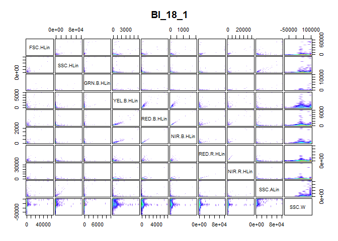
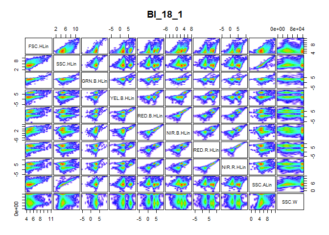
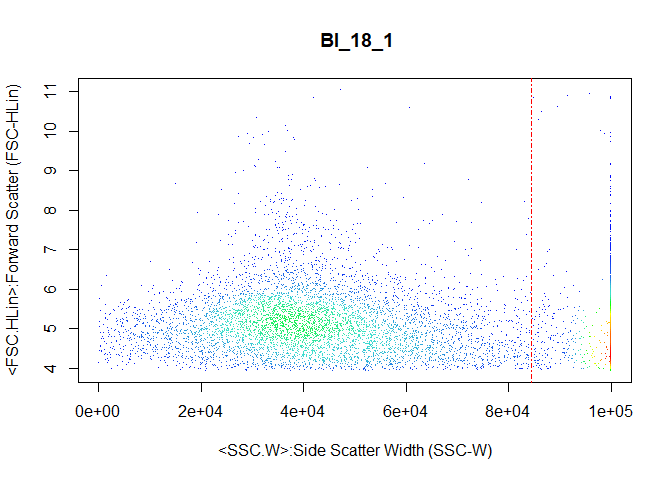
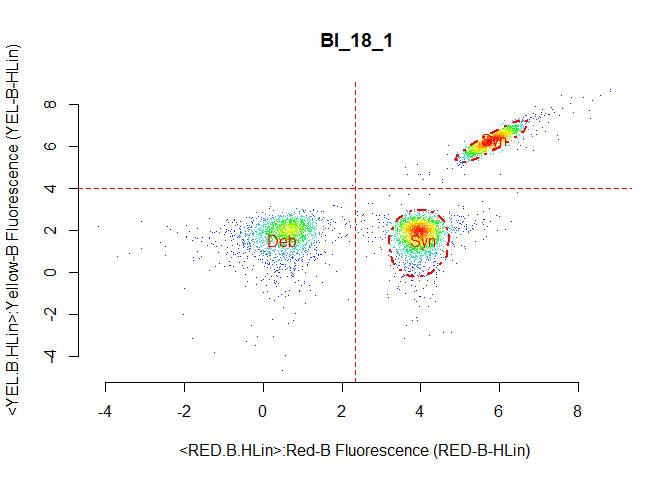
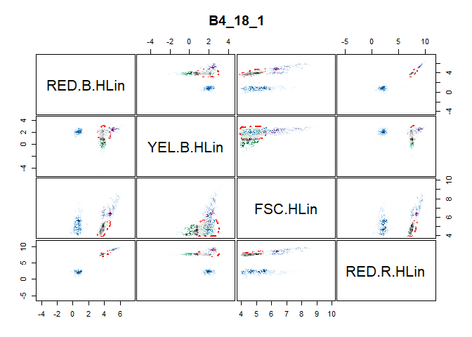

# cyanoFilter

<!---[](https://travis-ci.org/fomotis/cyanoFilter) -->

cyaoFilter is a package designed to identify, assign indicators and/or
filter out synechoccus type cyanobacteria from a water sample examined
with flowcytometry.

# Installation and Dependencies

Run the `code` below to install the package and all its dependencies.

``` r
install.packages("cyanoFilter")
```

All dependencies both on **CRAN** and **bioconductor** should be
installed when you install the package itself. However, do install the
following needed **bioconductor** packages should you run into errors
while attempting to use the functions in this package.

``` r
install.packages("BiocManager")
library(BiocManager)
install(c("Biobase", "flowCore", "flowDensity"))
```

# Motivation and Background

Flow cytometry (FCM) is a well-known technique for identifying cell
populations in fluids. It is largely applied in biological and medical
sciences for cell sorting, counting, biomarker detections and protein
engineering. Identifying cell populations in flow cytometry data, a
process termed gating can either be done mnually or via automated
algorithms. Recenntly, researchers also apply machine learning tools to
identify the different cell populations present in FCM data. Manual
gating can be quite subjective and often not reproducible, but it aids
the use of expert knowledge in the gating process, while machine
learning tools and automated algorithms often don’t allow the use of
expert knowledge in the gating process. To address this issue for
cyanobacteria FCM experiments, we develop the cyanoFilter framework in
**R**. We also demonstrate its use in filtering out two cyanobacteria
strains named BS4 and BS5.

# Usage

The package comes with 2 internal datasets that we use for demonstrating
the usage of the functions contained in the package. The **meta data**
file contains *BS4* and *BS5* samples measured with a guava easyCyte HT
series at 3 dilution levels (*2000*, *10000* and *20000*) each. The
**FCS** file contains the flow cytometer channel measurements for one of
these sample.

## Meta File Preprocessing

### The Good Measurements

The **goodfcs()** is deigned to check the \(cell/\mu\)L of the meta file
(normally csv) obtained from the flow cytometer and decide if the
measurements in the FCS file can be trusted. This function is
essentially useful for flow cytometers that are not equipped to perform
automated dilution.

``` r
library(flowCore)
library(cyanoFilter)
#internally contained datafile in cyanoFilter
metadata <- system.file("extdata", "2019-03-25_Rstarted.csv", 
  package = "cyanoFilter", 
  mustWork = TRUE)
metafile <- read.csv(metadata, skip = 7, stringsAsFactors = FALSE, 
  check.names = TRUE)
#columns containing dilution, $\mu l$ and id information
metafile <- metafile[, c(1:3, 6:8)] 
knitr::kable(metafile) 
```

| Sample.Number | Sample.ID  | Number.of.Events | Dilution.Factor | Original.Volume |   Cells.L |
| ------------: | :--------- | ---------------: | --------------: | --------------: | --------: |
|             1 | BS4\_20000 |             6918 |           20000 |              10 |  62.02270 |
|             2 | BS4\_10000 |             6591 |           10000 |              10 | 116.76311 |
|             3 | BS4\_2000  |             6508 |            2000 |              10 | 517.90008 |
|             4 | BS5\_20000 |             5976 |           20000 |              10 |  48.31036 |
|             5 | BS5\_10000 |             5844 |           10000 |              10 |  90.51666 |
|             6 | BS5\_2000  |             5829 |            2000 |              10 | 400.72498 |

Each row in the csv file corresponds to a measurement from two types of
cyanobacteria cells carried out at one of three dilution levels. The
columns contain information about the dilution level, the number of
cells per micro-litre (\(cell/\mu l\)), number of particles measured and
a unique identification code for each measurement. The *Sample.ID*
column is structured in the format cyanobacteria\_dilution. We extract
the cyanobacteria part of this column into a new column and also rename
the \(cell/\mu l\) column with the following code:

``` r
#extract the part of the Sample.ID that corresponds to BS4 or BS5
metafile$Sample.ID2 <- stringr::str_extract(metafile$Sample.ID, "BS*[4-5]")
#clean up the Cells.muL column
names(metafile)[which(stringr::str_detect(names(metafile), "Cells."))] <- "CellspML"
```

### The Good Measurements

To determine the appropriate data file to read from a FCM datafile, the
desired minimum, maximum and column containing the \(cell\mu l\) values
are supplied to the **goodfcs()** function. The code below demonstrates
the use of this function for a situation where the desired minimum and
maximum for \(cell/\mu l\) is 50 and 1000 respectively.

``` r
metafile$Status <- cyanoFilter::goodfcs(metafile = metafile, col_cpml = "CellspML", 
                                        mxd_cellpML = 1000, mnd_cellpML = 50)

knitr::kable(metafile)
```

| Sample.Number | Sample.ID  | Number.of.Events | Dilution.Factor | Original.Volume |  CellspML | Sample.ID2 | Status |
| ------------: | :--------- | ---------------: | --------------: | --------------: | --------: | :--------- | :----- |
|             1 | BS4\_20000 |             6918 |           20000 |              10 |  62.02270 | BS4        | good   |
|             2 | BS4\_10000 |             6591 |           10000 |              10 | 116.76311 | BS4        | good   |
|             3 | BS4\_2000  |             6508 |            2000 |              10 | 517.90008 | BS4        | good   |
|             4 | BS5\_20000 |             5976 |           20000 |              10 |  48.31036 | BS5        | bad    |
|             5 | BS5\_10000 |             5844 |           10000 |              10 |  90.51666 | BS5        | good   |
|             6 | BS5\_2000  |             5829 |            2000 |              10 | 400.72498 | BS5        | good   |

The function adds an extra column, *Status*, with entries *good* or
*bad* to the metafile. Rows containing \(cell/\mu l\) values outside the
desired minimum and maximum are labelled *bad*. Note that the *Status*
column for the fourth row is labelled *bad*, because it has a
\(cell/\mu l\) value outside the desired range.

### Files to Retain

Although any of the files labelled good can be read from the FCM file,
the **retain()** function can help select either the file with the
highest \(cell/\mu l\) or that with the smallest \(cell/\mu l\) value.
To do this, one supplies the function with the status column,
\(cell/\mu l\) column and the desired decision. The code below
demonstrates this action for a case where we want to select the file
with the maximum \(cell/\mu l\) from the good measurements for each
unique sample ID.

``` r
broken <- metafile %>% group_by(Sample.ID2) %>% nest()
metafile$Retained <- unlist(map(broken$data, function(.x) {
  retain(meta_files = .x, make_decision = "maxi",
  Status = "Status",
  CellspML = "CellspML")
 })
)
knitr::kable(metafile)
```

| Sample.Number | Sample.ID  | Number.of.Events | Dilution.Factor | Original.Volume |  CellspML | Sample.ID2 | Status | Retained |
| ------------: | :--------- | ---------------: | --------------: | --------------: | --------: | :--------- | :----- | :------- |
|             1 | BS4\_20000 |             6918 |           20000 |              10 |  62.02270 | BS4        | good   | No\!     |
|             2 | BS4\_10000 |             6591 |           10000 |              10 | 116.76311 | BS4        | good   | No\!     |
|             3 | BS4\_2000  |             6508 |            2000 |              10 | 517.90008 | BS4        | good   | Retain   |
|             4 | BS5\_20000 |             5976 |           20000 |              10 |  48.31036 | BS5        | bad    | No\!     |
|             5 | BS5\_10000 |             5844 |           10000 |              10 |  90.51666 | BS5        | good   | No\!     |
|             6 | BS5\_2000  |             5829 |            2000 |              10 | 400.72498 | BS5        | good   | Retain   |

This function adds another column, *Retained*, to the metafile. The
third and sixth row in the metadata are with the highest \(cell/\mu l\)
values, thus one can proceed to read the fourth and sixth file from the
corresponding FCM datafile for *BS4* and *BS5* respectively. This
implies that we are reading in only two FCM files rather than six needed
files.

## Flow Cytometer File Processing

To input the **B4\_18\_1.fcs** file into **R**, we use the
**read.FCS()** function from the **flowCore** package. The *dataset*
option enables the specification of the precise file to be read. Since
this datafile contains one file only, we set this option to 1. If this
option is set to 2, it gives an error since **text.fcs** contains only
one datafile.

``` r
flowfile_path <- system.file("extdata", "B4_18_1.fcs", package = "cyanoFilter",
  mustWork = TRUE)
flowfile <- read.FCS(flowfile_path, alter.names = TRUE,
  transformation = FALSE, emptyValue = FALSE,
  dataset = 1)
flowfile
> flowFrame object ' B4_18_1'
> with 8729 cells and 11 observables:
>            name                                desc range    minRange
> $P1    FSC.HLin          Forward Scatter (FSC-HLin) 1e+05    0.000000
> $P2    SSC.HLin             Side Scatter (SSC-HLin) 1e+05  -34.479282
> $P3  GRN.B.HLin   Green-B Fluorescence (GRN-B-HLin) 1e+05  -21.194536
> $P4  YEL.B.HLin  Yellow-B Fluorescence (YEL-B-HLin) 1e+05  -10.327441
> $P5  RED.B.HLin     Red-B Fluorescence (RED-B-HLin) 1e+05   -5.347203
> $P6  NIR.B.HLin Near IR-B Fluorescence (NIR-B-HLin) 1e+05   -4.307983
> $P7  RED.R.HLin     Red-R Fluorescence (RED-R-HLin) 1e+05  -25.490185
> $P8  NIR.R.HLin Near IR-R Fluorescence (NIR-R-HLin) 1e+05  -16.020023
> $P9    SSC.ALin        Side Scatter Area (SSC-ALin) 1e+05    0.000000
> $P10      SSC.W          Side Scatter Width (SSC-W) 1e+05 -111.000000
> $P11       TIME                                Time 1e+05    0.000000
>      maxRange
> $P1     99999
> $P2     99999
> $P3     99999
> $P4     99999
> $P5     99999
> $P6     99999
> $P7     99999
> $P8     99999
> $P9     99999
> $P10    99999
> $P11    99999
> 368 keywords are stored in the 'description' slot
```

The **R** object *flowfile* contains measurements about cells across 10
channels since the time channel does not contain any information about
the properties of the measured cells.

### Transformation and visualisation

To examine the need for transformation, a visual representation of the
information in the expression matrix is of great use. The
**pair\_plot()** function produces a panel plot of all measured
channels. Each plot is also smoothed to show the cell density at every
part of the plot.

``` r
flowfile_nona <- nona(x = flowfile)
pair_plot(flowfile_nona, notToPlot = "TIME")
```


We obtain Figure above by using the **pair\_plot()** function after
removing all NA values from the expression matrix with the **nona()**
function.

``` r
#natural logarithm transformation
flowfile_noneg <- noneg(x = flowfile_nona)
flowfile_logtrans <- lnTrans(x = flowfile_noneg, 
  notToTransform = c("SSC.W", "TIME"))
pair_plot(flowfile_logtrans, notToPlot = "TIME")
```


The second figure is the result of performing a logarithmic
transformation in addition to the previous actions taken. The
logarithmic transformation appears satisfactory in this case, as it
allow a better examination of the information contained in each panel of
the figure. Moreover, the clusters are clearly visible in this figure
compared to the former figure. Other possible transformation (linear,
bi-exponential and arcsinh) can be pursued if the logarithm
transformation is not satisfactory. Functions for these transformations
are provided in the **flowCore** package.

## Gating

Flow cytometry outcomes can be divided into 3 and they are not entirely
mutually exclusive but this is normally not a problem as scientists are
normally interested in a pre-defined outcome.

<!------>

  - Margin Events are particles too big to be measured
  - Doublets are cells with disproportionate Area, Height relationship
  - Singlets are the ‘normal cells’ but these could either be dead
    cells/particles (debris) and living (good cells).

The set of functions below identifies margin events and singlets.
Doublets are normally pre-filtered during the event acquiring phase of
measuring.

### Gating margin events

To remove margin events, the **cellmargin()** function takes the column
in the expression matrix corresponding to measurements about the width
of each cell. The code below demonstrates the removal of margin events
using the SSC.W column with the option to estimate the cut point between
the margin events and the good cells.

``` r
flowfile_marginout <- cellmargin(flow.frame = flowfile_logtrans,
  Channel = 'SSC.W', type = 'estimate', y_toplot = "FSC.HLin")
```


The function returns a figure (Figure @ref(fig:marginEvents)) in this
case) and a list containing:

  - *fullflowframe*, flowframe with indicator for margin and non-margin
    events in the expression matrix,
  - *reducedflowframe*, flowframe containing only non-margin events
  - *N\_margin*, number of margin events contained in the input
    flowframe
  - *N\_nonmargin*, number of non-margin events
  - *N\_particle*, number of particles in the input flowframe

The code below accesses the number of margin and non-margin particles.

``` r
flowfile_marginout$N_margin
> [1] 3092
flowfile_marginout$N_nonmargin
> [1] 3831
```

### Gating debris and cyanobacteria

We conceptualized the division of cells into clusters in two ways in
cyanoFilter and this is reflected in two main functions that perform the
clustering exercise; **celldebris\_nc()** and
**celldebris\_emclustering()**. The **celldebris\_nc()** function
employs minimum intersection points between peaks observed in a two
dimensional kernel density, while **celldebris\_emclustering()** employs
a finite mixture of multivariate normals to assign probability of
belonging to a cluster to each measured particle. Both functions produce
plots by default to enable users examine the results of the clustering.

After removing margin events, it is of interest to identify BS4
cyanobacteria cells contained in the **text.fcs** datafile that we have
pre-processed until now. The following code separates BS4 cyanobacteria
cells using the two channels measuring the presence of chlorophyll *a*,
RED.B.HLin, and phycoerythrin, YEL.B.HLin. We use the knowledge of
knowing that the BS4 cells will be on the right part of the RED.B.HLin
channel because of the presence of chlorophyll *a*, and also on the
lower part of the YEL.B.HLin channel due to low presence of
phycoerythrin.

``` r

bs4_gate1 <- celldebris_nc(flowfile_marginout$reducedflowframe, 
  channel1 = "RED.B.HLin", channel2 = "YEL.B.HLin", 
  interest = "bottom-right", to_retain = "refined" )
```


The resulting object is a figure (Figure @ref(fig:kdapproach)) and a
list containing the following:

  - *reducedframe*, a flowFrame with all debris removed
  - *fullframe*, flowFrame with all measured particles and indicator for
    debris and cyanobacteria cells
  - *Cell\_count*, the number of BS4 cells counted
  - *Debris\_Count*, the number of debris particles.

An alternative function for identifying BS4 cells is the
**celldebris\_emclustering()** function. This function tries to identify
the number of clusters supplied via the *ncluster* option, but this
number is reduced if there are clusters with no particles during the EM
iterations. The function can also accept more than two channels as
input. The code below demonstrates its use with four channels measuring
chlorophyll *a*, phycoerythrin, height and phycocyanin respectively.

``` r

bs4_gate2 <- celldebris_emclustering(flowfile_marginout$reducedflowframe, 
  channels =  c("RED.B.HLin", "YEL.B.HLin", "FSC.HLin", "RED.R.HLin"), 
  ncluster = 3, min.itera = 20, classifier = 0.8)
```


The resulting object is a figure (Figure @ref(fig:emapproach)) and a
list containing the following:

1)  *percentages* the final weight for each cluster
2)  *mus*, matrix of means for each channel per cluster
3)  *sigmas*, list containing variance-covariace matrices for each
    cluster,
4)  *result*, flowfile with an expression matrix containing all the
    measured particles and the associated probability of each particle
    belonging to a cluster.

Users can examine the means or cluster weights to determine which
cluster is of interest, and then filter out particles belonging to that
cluster with a certain minimum probability. For example, we demonstrate
an example below by filtering out particles belonging to the cluster
with the highest weight by at least 80%.

``` r
max_cluster_weight <- which(bs4_gate2$percentages == 
  max(bs4_gate2$percentages))
cluster_name <- paste("Cluster", "Prob", 
  max_cluster_weight, sep = "_")
reduced_frame <- which(bs4_gate2$result[, cluster_name] >= 0.80)
```

The object *reduced\_frame* is a flowframe containing all particles
belonging to the largest cluster with probability of at least 80%.
Following the same steps or knowledge of these cells, users can filter
out particles belonging to certain clusters with characteristics of
interest to them.

### Gating Debris and cyanobacteria in biculture

The second file used for demonstration contains both BS4 and BS5
cyanobacteria cells.

``` r
flowfile2_path <- system.file("extdata", "B4_B5_18_1.fcs", package = "cyanoFilter",
  mustWork = TRUE)
flowfile2 <- read.FCS(flowfile2_path, alter.names = TRUE,
  transformation = FALSE, emptyValue = FALSE,
  dataset = 1)
flowfile2
> flowFrame object ' BI_18_1'
> with 12665 cells and 11 observables:
>            name                                desc range    minRange
> $P1    FSC.HLin          Forward Scatter (FSC-HLin) 1e+05    0.000000
> $P2    SSC.HLin             Side Scatter (SSC-HLin) 1e+05  -15.474201
> $P3  GRN.B.HLin   Green-B Fluorescence (GRN-B-HLin) 1e+05  -25.141722
> $P4  YEL.B.HLin  Yellow-B Fluorescence (YEL-B-HLin) 1e+05  -13.833652
> $P5  RED.B.HLin     Red-B Fluorescence (RED-B-HLin) 1e+05   -7.098767
> $P6  NIR.B.HLin Near IR-B Fluorescence (NIR-B-HLin) 1e+05   -7.817278
> $P7  RED.R.HLin     Red-R Fluorescence (RED-R-HLin) 1e+05  -32.829483
> $P8  NIR.R.HLin Near IR-R Fluorescence (NIR-R-HLin) 1e+05  -15.511206
> $P9    SSC.ALin        Side Scatter Area (SSC-ALin) 1e+05    0.000000
> $P10      SSC.W          Side Scatter Width (SSC-W) 1e+05 -111.000000
> $P11       TIME                                Time 1e+05    0.000000
>      maxRange
> $P1     99999
> $P2     99999
> $P3     99999
> $P4     99999
> $P5     99999
> $P6     99999
> $P7     99999
> $P8     99999
> $P9     99999
> $P10    99999
> $P11    99999
> 368 keywords are stored in the 'description' slot
```

All the steps previously demonstrated remains unchanged, s we carry it
all out in one huge code chunk.

``` r
flowfile_nona2 <- nona(x = flowfile2)
pair_plot(flowfile_nona2, notToPlot = "TIME")
```

<!-- -->

``` r

#natural logarithm transformation
flowfile_noneg2 <- noneg(x = flowfile_nona2)
flowfile_logtrans2 <- lnTrans(x = flowfile_noneg2, 
  notToTransform = c("SSC.W", "TIME"))
pair_plot(flowfile_logtrans2, notToPlot = "TIME")
```

<!-- -->

``` r

#gating margin events
flowfile_marginout2 <- cellmargin(flow.frame = flowfile_logtrans2,
  Channel = 'SSC.W', type = 'estimate', y_toplot = "FSC.HLin")
```

<!-- -->

Again we use the two channels measuring cholorophyll *a* and
phycoerythrin, but we set the **interest** option to *both-right*. This
means that we are expecting the cyanobacteria cells to be on the right
of channel 1.

``` r
bs45_gate1 <- celldebris_nc(flowfile_marginout2$reducedflowframe, 
  channel1 = "RED.B.HLin", channel2 = "YEL.B.HLin", 
  interest = "both-right", to_retain = "refined" )
```

<!-- -->

For the *EM* clustering approach, nothing changes as well. However,
users must analyse the result of the clustering to determine which
cluster is of interest.

``` r
bs4_gate2 <- celldebris_emclustering(flowfile_marginout$reducedflowframe, 
  channels =  c("RED.B.HLin", "YEL.B.HLin", "FSC.HLin", "RED.R.HLin"), 
  ncluster = 4, min.itera = 20, classifier = 0.8)
```

<!-- -->

# License

This is a free to use package for anyone who has the need.
